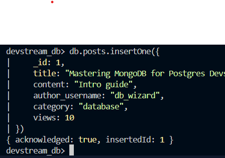
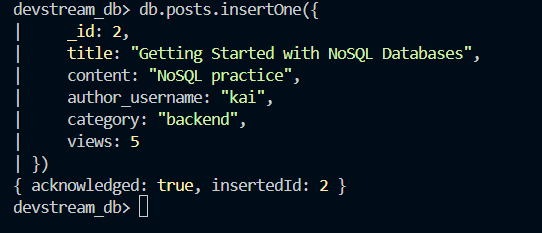
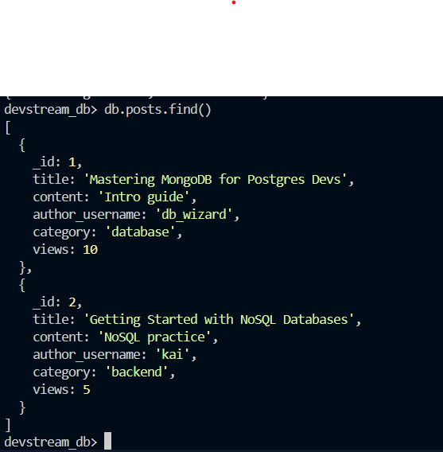
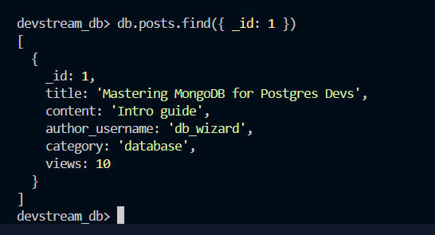
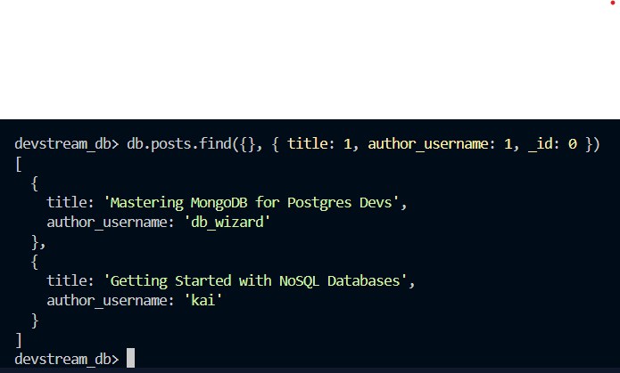
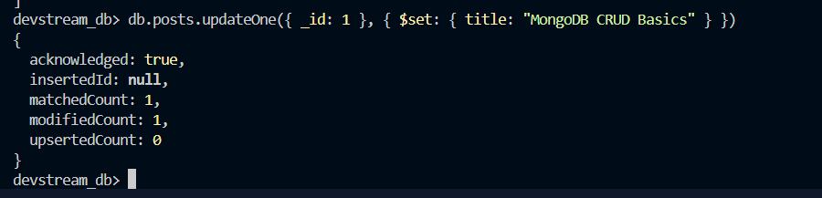
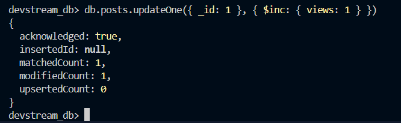
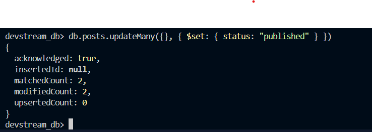
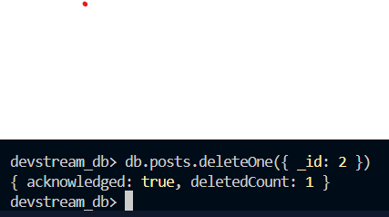

# Activity 10 Solution

## Part 1: Quick Mapping (Postgres -> MongoDB)

| PostgreSQL | MongoDB Equivalent |
|---|---|
| `INSERT INTO posts ...` | `db.posts.insertOne({...})` |
| `SELECT * FROM posts WHERE title='...'` | `db.posts.find({title: "..."})` |
| `UPDATE posts SET title='...' WHERE id=...` | `db.posts.updateOne({_id: ...}, {$set: {title: "..."}})` |
| `DELETE FROM posts WHERE id=...` | `db.posts.deleteOne({_id: ...})` |

## Part 2: Hands-on CRUD in MongoDB

### 2.1 Setup

Commands:

```javascript
use devstream_db
db.posts.drop()

db.posts.insertOne({
    _id: 1,
    title: "Mastering MongoDB for Postgres Devs",
    content: "Intro guide",
    author_username: "db_wizard",
    category: "database",
    views: 10
})
```

Screenshot(s):
- 

### 2.2 Create

Commands:

```javascript
db.posts.insertOne({
    _id: 2,
    title: "Getting Started with NoSQL Databases",
    content: "NoSQL practice",
    author_username: "kai",
    category: "backend",
    views: 5
})
```

Screenshot(s):
- 

### 2.3 Read

Commands:

```javascript
db.posts.find()
```

```javascript
db.posts.find({ _id: 1 })
```

```javascript
db.posts.find({}, { title: 1, author_username: 1, _id: 0 })
```

Screenshot(s):
- 
- 
- 

### 2.4 Update

Commands:

```javascript
db.posts.updateOne({ _id: 1 }, { $set: { title: "MongoDB CRUD Basics" } })
```

```javascript
db.posts.updateOne({ _id: 1 }, { $inc: { views: 1 } })
```

```javascript
db.posts.updateMany({}, { $set: { status: "published" } })
```

Screenshot(s):
- 
- 
- 

### 2.5 Delete

Commands:

```javascript
db.posts.deleteOne({ _id: 2 })
```

Screenshot(s):
- 

## Part 3: Reflection (3-4 sentences)

1. One thing that feels easier in MongoDB CRUD:

One thing that feels easier in MongoDB CRUD is the flexibility of inserting documents since there is no need to define a fixed schema beforehand. Operators like `$set` and `$inc` also make updates straightforward and readable.

2. One thing that was clearer in PostgreSQL CRUD:

PostgreSQL CRUD feels clearer when working with structured and relational data because SQL syntax is strict and predictable. It is also easier to manage relationships between records using foreign keys and joins.
