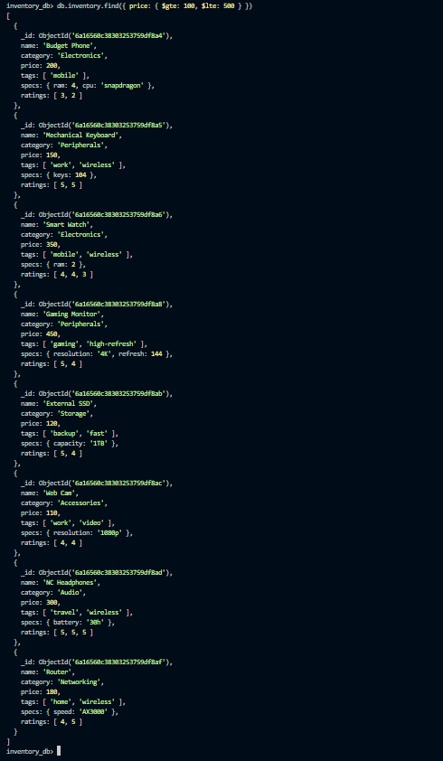
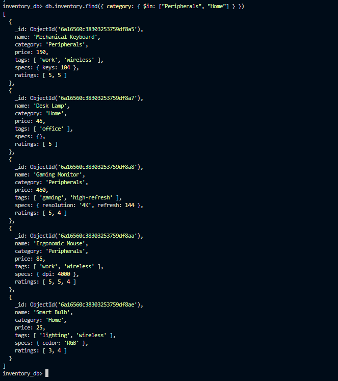
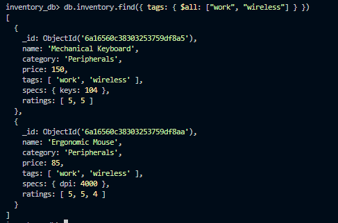
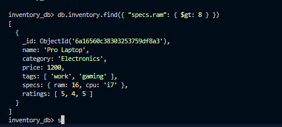
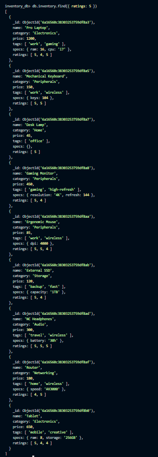
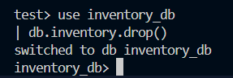
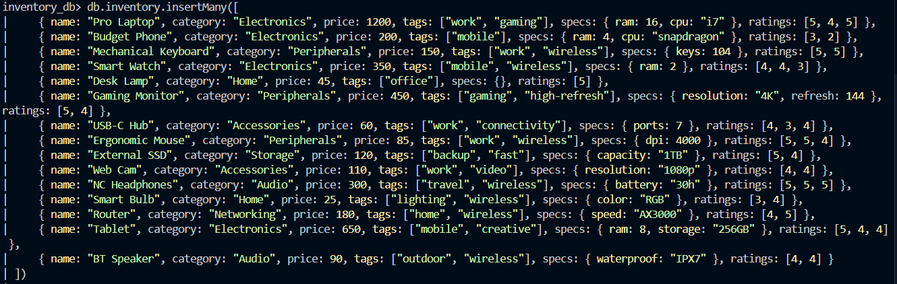
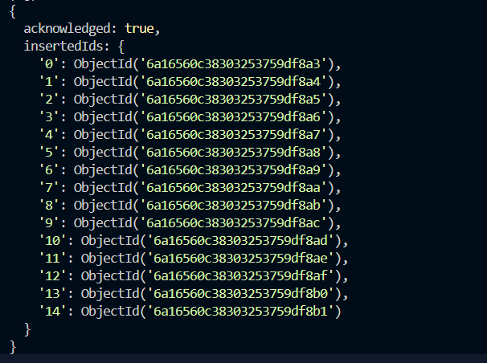

# Activity 11 Solution

## Part 1: Relational to Document Modeling

### 1. Proposed JSON Schema

```json
{
  "_id": "ObjectId(...)",
  "title": "Building REST APIs with Node.js",
  "body": "In this post we explore how to build scalable REST APIs...",
  "created_at": "2026-03-10T10:00:00Z",
  "author": {
    "username": "kai",
    "email": "kai@devconnect.io",
    "bio": "Full-stack developer and open source contributor"
  },
  "tags": ["nodejs", "api", "backend"]
}
```

### 2. Strategic Choices

- **Tags:** Embed
- **Author:** Embed

### 3. Justification

Tags are embedded because they are short string values that are read together with the post and rarely change independently — embedding avoids extra lookups and keeps queries simple. The author's core display info (username, bio) is also embedded since posts always need to show who wrote them, and a reference would require an extra query every time a post is loaded. While author data can change, the fields embedded here are stable enough that occasional updates are acceptable for the read performance benefit.

---

## Part 2: Querying with MQL Operators

### Insert Script

```javascript
use inventory_db
db.inventory.drop()

db.inventory.insertMany([
    { name: "Pro Laptop", category: "Electronics", price: 1200, tags: ["work", "gaming"], specs: { ram: 16, cpu: "i7" }, ratings: [5, 4, 5] },
    { name: "Budget Phone", category: "Electronics", price: 200, tags: ["mobile"], specs: { ram: 4, cpu: "snapdragon" }, ratings: [3, 2] },
    { name: "Mechanical Keyboard", category: "Peripherals", price: 150, tags: ["work", "wireless"], specs: { keys: 104 }, ratings: [5, 5] },
    { name: "Smart Watch", category: "Electronics", price: 350, tags: ["mobile", "wireless"], specs: { ram: 2 }, ratings: [4, 4, 3] },
    { name: "Desk Lamp", category: "Home", price: 45, tags: ["office"], specs: {}, ratings: [5] },
    { name: "Gaming Monitor", category: "Peripherals", price: 450, tags: ["gaming", "high-refresh"], specs: { resolution: "4K", refresh: 144 }, ratings: [5, 4] },
    { name: "USB-C Hub", category: "Accessories", price: 60, tags: ["work", "connectivity"], specs: { ports: 7 }, ratings: [4, 3, 4] },
    { name: "Ergonomic Mouse", category: "Peripherals", price: 85, tags: ["work", "wireless"], specs: { dpi: 4000 }, ratings: [5, 5, 4] },
    { name: "External SSD", category: "Storage", price: 120, tags: ["backup", "fast"], specs: { capacity: "1TB" }, ratings: [5, 4] },
    { name: "Web Cam", category: "Accessories", price: 110, tags: ["work", "video"], specs: { resolution: "1080p" }, ratings: [4, 4] },
    { name: "NC Headphones", category: "Audio", price: 300, tags: ["travel", "wireless"], specs: { battery: "30h" }, ratings: [5, 5, 5] },
    { name: "Smart Bulb", category: "Home", price: 25, tags: ["lighting", "wireless"], specs: { color: "RGB" }, ratings: [3, 4] },
    { name: "Router", category: "Networking", price: 180, tags: ["home", "wireless"], specs: { speed: "AX3000" }, ratings: [4, 5] },
    { name: "Tablet", category: "Electronics", price: 650, tags: ["mobile", "creative"], specs: { ram: 8, storage: "256GB" }, ratings: [5, 4, 4] },
    { name: "BT Speaker", category: "Audio", price: 90, tags: ["outdoor", "wireless"], specs: { waterproof: "IPX7" }, ratings: [4, 4] }
])
```

### 1. Price Range
Find all items priced between $100 and $500 (inclusive).

```javascript
db.inventory.find({ price: { $gte: 100, $lte: 500 } })
```

Screenshot:


### 2. Category Match
Find all items that are in either the "Peripherals" or "Home" categories.

```javascript
db.inventory.find({ category: { $in: ["Peripherals", "Home"] } })
```

Screenshot:


### 3. Tag Power
Find all items that have both the "work" AND "wireless" tags.

```javascript
db.inventory.find({ tags: { $all: ["work", "wireless"] } })
```

Screenshot:


### 4. Nested Check
Find all items where the `specs.ram` is greater than 8GB.

```javascript
db.inventory.find({ "specs.ram": { $gt: 8 } })
```

Screenshot:


### 5. High Ratings
Find all items that have at least one `5` in their `ratings` array.

```javascript
db.inventory.find({ ratings: 5 })
```

Screenshot:


### Screenshots

- 
- 
- 
- 
- 
- 
- 
- 